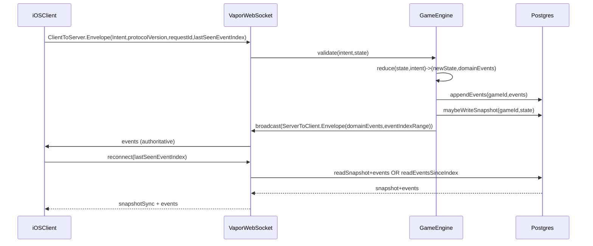

# TradeRoads: iOS + Vapor + GameCore (event-sourced)

## Goals

- Implement **CATAN base rules for 3–4** plus **official 5–6 paired-player rules** as a deterministic state machine in `Packages/GameCore`.
- Implement an **authoritative Vapor WebSocket server** in `Server/` that validates intents with GameCore, persists **event logs + snapshots** in Postgres, and supports **reconnect/state recovery**.
- Implement an iPhone-first **SwiftUI + SpriteKit** client in `Apps/iOS/TradeRoads` with an **Interaction Engine** (gestures → intents) and **event-to-cinematic** animation scripts.
- Implement **deep tests** across packages: unit + property/invariant + deterministic replay + server integration + client UI smoke.
- Enforce **no stubs/TODOs** and keep module boundaries clean.

## Repo shape (target)

- `Packages/GameCore/` (pure deterministic rules + replay)
- `Packages/CatanProtocol/` (versioned wire protocol + golden tests)
- `Server/` (Vapor app, DB migrations, snapshotter, WS gateway)
- `Apps/iOS/TradeRoads/` (SwiftUI shell, SpriteKit board, interaction engine, animation scripts)
- `docs/` (architecture, protocol, decisions, runbooks)
- `scripts/` (one-command local dev + tests)

## Architecture & message flow

### Core invariants

- **Server is source of truth**: only server commits events.
- **Clients are cinematic renderers**: clients animate domain events and can rebuild state from event log.
- **Shared deterministic rules**: GameCore has no UI/network/timers.

## Protocol package (`Packages/CatanProtocol`)

Implement the structure you described:

- [`Packages/CatanProtocol/Sources/CatanProtocol/ProtocolVersion.swift`](Packages/CatanProtocol/Sources/CatanProtocol/ProtocolVersion.swift)
- `ProtocolVersion.current`, `minSupported`, `current`
- [`Packages/CatanProtocol/Sources/CatanProtocol/WireEnvelope.swift`](Packages/CatanProtocol/Sources/CatanProtocol/WireEnvelope.swift)
- Envelope includes: `protocolVersion`, `messageType` (tagged enum), `payload`, `requestId`, `correlationId`, `sentAt`
- Shared encoder/decoder settings (date + key strategies) exposed as `CatanJSON.encoder/decoder`
- [`Packages/CatanProtocol/Sources/CatanProtocol/Messages/ClientToServer.swift`](Packages/CatanProtocol/Sources/CatanProtocol/Messages/ClientToServer.swift)
- `Intent` messages (place road/settlement/city, trade offers, roll dice request, dev card plays, robber move/steal, end turn, lobby actions, reconnect)
- [`Packages/CatanProtocol/Sources/CatanProtocol/Messages/ServerToClient.swift`](Packages/CatanProtocol/Sources/CatanProtocol/Messages/ServerToClient.swift)
- `DomainEvents` broadcast, lobby updates, snapshot sync, protocol errors
- Tests:
- [`Packages/CatanProtocol/Tests/CatanProtocolTests/RoundTripCodableTests.swift`](Packages/CatanProtocol/Tests/CatanProtocolTests/RoundTripCodableTests.swift) round-trip all messages
- [`Packages/CatanProtocol/Tests/CatanProtocolTests/GoldenFilesTests.swift`](Packages/CatanProtocol/Tests/CatanProtocolTests/GoldenFilesTests.swift) loads JSON fixtures and verifies decode+re-encode stability

### Versioning behavior

- Server rejects envelopes outside `[minSupported, current]` by responding with a single `ProtocolError.unsupportedVersion` (and does **not** mutate game state).

## GameCore (`Packages/GameCore`)

### Domain model

Create a deterministic model and event set to fully represent the game:

- Board: hexes, ports/harbors, number tokens, robber position; supports **3–4** and **5–6** layouts.
- Graph: nodes/edges with IDs; settlement/city on nodes; roads on edges.
- Players: public info (color, counts, VP) + private hand (resources/dev cards) with controlled visibility.
- Bank/supply: resource counts, piece supplies, dev deck.
- Awards: Longest Road, Largest Army.
- Turn engine: phases (setup, roll, discard/robber, trade, build, end), and 5–6 paired-player markers.

### State machine API

- Immutable `GameState`.
- `GameAction` (player intent).
- `validate(action:state:) -> [RuleViolation]` (human-readable).
- `reduce(state:action:rng:) -> (newState, [DomainEvent])`.
- `apply(state:event:) -> newState`.
- `rebuild(initial:events:)` for replay.
- RNG abstraction:
- `RNG` protocol with deterministic seeded implementation for tests
- secure RNG on server (outside GameCore) provides entropy for dice/dev deck draws

### Rules completeness

Implement all items in your checklist:

- Setup: beginner fixed layout + randomized terrain + token placement rules; harbors; 5–6 board.
- Turn flow: production roll; 7 handling (discard, robber move, steal); trade restriction (active-player-only domestic trade); combined trade/build toggle.
- Building: adjacency rules; distance rule; city upgrade; costs; supply limits.
- Dev cards: buy, hidden, “can’t play same turn” (except VP handling per rules), one-per-turn restriction, Knight/Monopoly/YearOfPlenty/RoadBuilding.
- Longest Road: correct graph computation with branching and blocking.
- Winning: 10 VP only on your turn; 5–6 paired-player win rules.
- 5–6 paired-player system: markers, what player 2 can do, marker passing + dice handling per the 2022/2024 rules PDF.

### GameCore test strategy

- Unit tests for each rule path with readable names.
- Property/invariant tests (deterministic generators):
- no negative resources
- cannot exceed supply
- robber blocks production
- distance rule always respected
- event application is associative with replay (apply all events == reduced state)
- Deterministic replay “golden game” logs (event sequences) that must replay to identical final state.

## Server (Vapor) in `Server/`

### Components

- Vapor app importing `GameCore` + `CatanProtocol`.
- WebSocket gateway:
- decode `WireEnvelope`
- auth/session validation
- lobby/game routing
- backpressure + message size limits
- Authoritative engine:
- per-game actor/serial queue to ensure deterministic ordering
- validate intents via GameCore
- commit events to DB in a transaction
- broadcast events to connected clients
- Persistence (Postgres via Fluent):
- tables: `users`, `sessions`, `games`, `lobbies`, `players`, `game_events`, `game_snapshots`
- snapshot schedule: every N events or M seconds (server controlled)
- reconnect: given `lastSeenEventIndex`, server returns missing events or snapshot+events

### Auth (v1 dev auth)

- Implement fully (no stubs), tested:
- create identity with username/email-ish string
- server issues signed session token (HMAC) and stores session row (revocable)
- client includes token in WS connect envelope or initial auth message
- document swap path to Sign in with Apple in `docs/decisions.md`

### Server tests

- WebSocket integration tests:
- protocol version rejection
- intent validation rejection (no state mutation)
- persistence correctness (events stored, snapshots generated)
- reconnect correctness (missing events exactly once)
- anti-cheat checks (player can only send intents for themselves)

### Local dev

- `docker-compose.yml` for Postgres.
- `scripts/dev.sh` to boot db + server.

## iOS client (`Apps/iOS/TradeRoads`)

### App architecture

- SwiftUI navigation + overlays (lobby, game HUD, hand, trade, dev cards, dialogs).
- SpriteKit board scene:
- interactive nodes/edges with hit testing
- piece pickup/drag/snap
- subtle legal target highlighting
- Interaction Engine:
- gesture recognizers → `GameAction` intents (no local authoritative mutation)
- local “speculative preview” layer (visual-only) that can be rolled back on server events
- Event-to-cinematic mapping:
- animation scripts per `DomainEvent` (dice roll, distribute resources, build placements, robber move, steal reveal, dev card flip)
- scripts are cancel-safe and replay-safe (idempotent per event index)

### Player privacy

- Online: only show own private hand; others show counts only.
- Local debug mode: “handoff privacy screen” between turns; requires per-player confirm to reveal hand.

### Client networking

- WS client that:
- sends intents with `requestId`
- tracks `lastSeenEventIndex`
- on reconnect, requests missing events / snapshot sync
- applies server events to rebuild local state via GameCore replay

### iOS tests

- UI smoke tests for:
- create/join lobby
- ready/start
- perform a couple turns (roll, build, end)
- Deterministic replay UI sanity: load a fixed event log and verify key UI elements appear.

## Documentation (`docs/`)

- `docs/architecture.md` (modules, data flow, event sourcing)
- `docs/protocol.md` (envelopes, message catalog, versioning)
- `docs/running.md` (local dev end-to-end)
- `docs/testing.md` (how to run all test suites)
- `docs/decisions.md` (auth choice, encoding settings, snapshot cadence, RNG strategy)

## “No stubs” audit

- Add a CI-style script in `scripts/` that fails on `TODO`, `FIXME`, `fatalError(`, and obvious placeholders.

## Milestone execution order

1. **CatanProtocol**: envelope + versioning + tests + golden fixtures.
2. **GameCore**: full rules + deterministic RNG + replay + exhaustive tests.
3. **Server**: Vapor WS + DB schema + event log + snapshot + reconnect + tests.
4. **iOS**: lobby + networking + state rebuild + SpriteKit board + interaction engine.
5. **Cinematics/polish**: animations, haptics, sound hooks, accessibility.